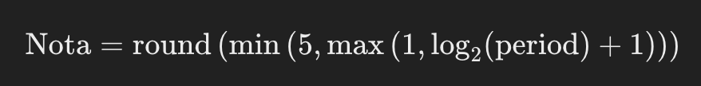
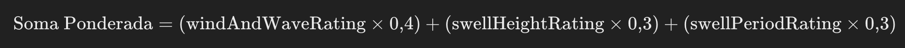

# Serviço de Rating

Este serviço calcula a nota final baseada nos ratings de vento e onda, altura da onda e período da onda. Ele inclui duas funções principais: `getRatingForSwellPeriod` e `getWeightedSum`.

## Instalação

Para instalar as dependências necessárias, use o Yarn:

```bash
yarn install
```

### Executando o Serviço

Para iniciar o serviço em modo de desenvolvimento, use o seguinte comando:

```bash
yarn start:dev
```

### Funções de Cálculo de Rating

1. `getRatingForSwellPeriod(period: number): number`

Essa função retorna uma nota de 1 a 5 baseada no período da onda. O cálculo é feito utilizando a seguinte fórmula:



**Entrada**: Período da onda (`period`) como um número.

**Saída**: Uma nota entre 1 e 5.

2. `getWeightedSum(windAndWaveRating: number, swellHeightRating: number, swellPeriodRating: number): number`

Esta função calcula a soma ponderada das notas de vento e onda, altura da onda e período da onda. A soma ponderada é calculada utilizando a seguinte fórmula:



**Entrada**:

- `windAndWaveRating`: Nota para vento e onda.
- `swellHeightRating`: Nota para altura da onda.
- `swellPeriodRating`: Nota para período da onda.

**Saída**: A soma ponderada das notas.
